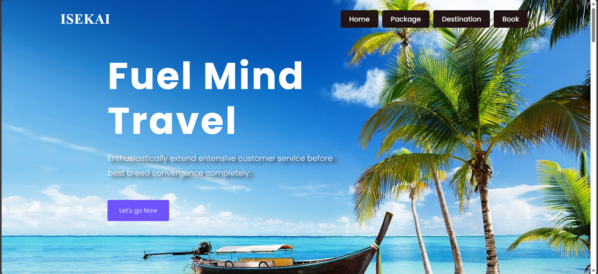
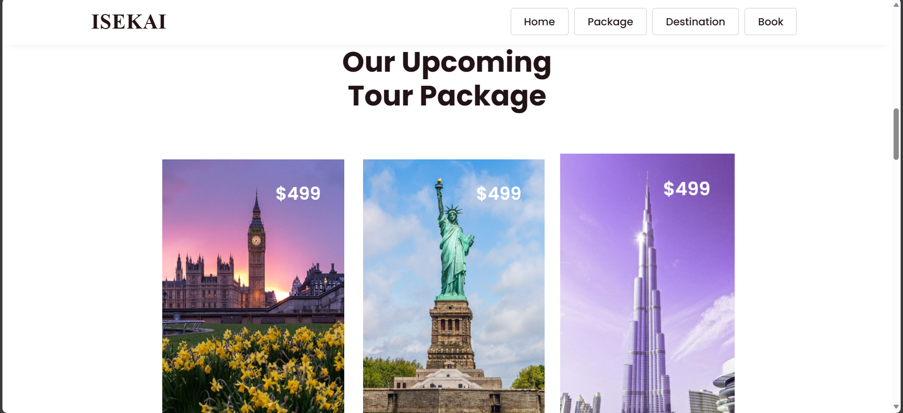

# ISEKAI

## Project-Documentation

 🏠 Home Page
<p align="center">
  <a href="" rel="noopener">
 </a>
</p>

<h3 align="center">ISEKAI <br> Tour & Travel webpage</h3>

---

<p align="center"> This project is my project where I tried to do a user-friendly and creative tour and travel website. 
    <br> 
</p>

## 📝 Table of Contents
- [About](#about)

- [Getting Started](#getting_started)

- [Installing](#install)

- [Extentions used in VS Code](#extention)

- [Authors](#authors)

- [Acknowledgments](#acknowledgement)

## 🧐 About <a name = "about"></a>
At Wanderlust Journeys, we believe that travel is not just about reaching a destination; it's about the experiences, the memories, and the stories that unfold along the way. <p>Our tour and travel website is designed to be your ultimate companion in crafting the perfect journey, whether you're a solo explorer, a couple seeking a romantic getaway, or a family in search of new horizons.</p> <p>Navigating through our website is as seamless as embarking on your dream vacation.</p><p>The homepage welcomes you with stunning visuals of diverse destinations, enticing you to explore further.</p> <p>The user-friendly interface ensures that you can effortlessly browse through our extensive collection of tours, each carefully curated to offer a unique and immersive experience.</p>

## 🏁 Getting Started <a name = "getting_started"></a>
Choose your destination from the <a href="https://darkmatri.github.io/Travel/" id="link" style="text-decoration:none;"> Diverse Destinations, Tailored Experiences </a>by clicking here.
<p>From the snow-capped peaks of the Himalayas to the sun-kissed beaches of the Maldives, our range of destinations spans the globe. Whether you're a culture enthusiast, an adventure seeker, or a relaxation aficionado, we have the perfect itinerary for you. Each tour is crafted with meticulous attention to detail, ensuring that every moment of your journey is filled with discovery and delight.</p>

### Prerequisites

Creating a successful travel webpage involves careful planning and consideration of various elements to ensure a seamless user experience. Here are some key prerequisites to keep in mind:
```
1.USER FRIENDLY
    Intuitive Navigation: 
          Ensure that the website is easy to navigate. Use clear menus, categories, and call-to-action buttons.

    Intuitive Navigation: 
          Responsive Design: Optimize the webpage for different devices, ensuring a seamless experience on desktops, tablets, and smartphones.

2.Engaging Visuals:
    High-Quality Imagery: 
          Use high-resolution images that showcase the destinations, activities, and accommodations.
    Videos:
          Incorporate engaging videos to provide a dynamic preview of the travel experiences.

3.Clear and Compelling Content:
    Destination Descriptions: 
          Provide detailed information about each destination, including its cultural significance, attractions, and unique features.
    Tour Itineraries: 
          Clearly outline the details of each tour, including activities, accommodations, and any included amenities.
    Travel Tips: 
          Offer practical advice and tips for travelers, such as packing lists, cultural norms, and local customs.

4.Personalization Features:
    User Profiles: 
          Allow users to create profiles where they can save preferences, view past bookings, and receive personalized recommendations.
    Customizable Itineraries: 
          Implement a tool that allows users to customize their travel itineraries based on preferences, interests, and budget.

5.Secure Booking System:
    SSL Certificate: 
          Ensure the website has a Secure Sockets Layer (SSL) certificate to encrypt data and secure online transactions.
    Payment Gateway: 
          Integrate a reliable and secure payment gateway to process bookings.
```
### Installing <a name = "install"></a>

To install vs code click the URL below:

### https://code.visualstudio.com/download

## Extentions used in VS Code <a name = "extention"></a>
- HTML5
- HTML boilerplate
- Beautify
- HTML CSS support

## ✍️ Authors <a name = "authors"></a>
- All copyrights are reserved by Kannan G

## 🎉 Acknowledgements <a name = "acknowledgement"></a>
- Hat tip to anyone whose code was used
- Books, skill-lync
- inspired by travel webpages

## 🎉 Screenshots <a name = "Screenshots"></a>

### Home Page


 ### Services
 

 ### Destination
 

 ### Packages
 

 ### NEWSletter
 

 ### Booking
 

 ### Footer
 

 ### Mobile Version
 
 
 

